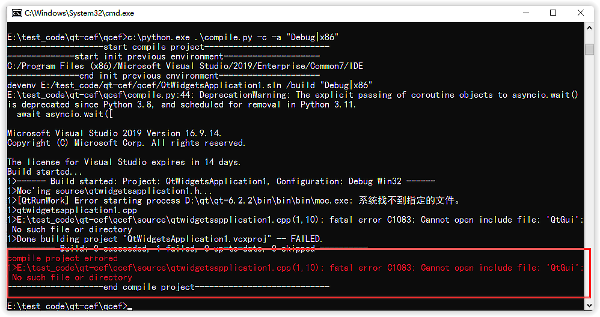
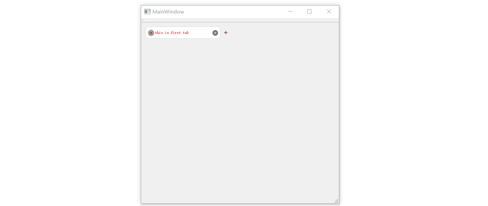

[TOC]

## 记录工作中提升效率的工具集合

## 1.compile.py

### 1.目的
这个脚本的主要目的就是能够在命令行自动编译程序，杀掉程序，启动程序，更新代码。
可以帮我节省几分钟的时间。剩下的这几分钟时间，可以让我思考刚才的修改的代码有没有问题。
这个脚本通过`config.json`配置一些属性

| 支持功能           |
| ------------------ |
| 命令行自动编译程序 |
| 杀掉程序           |
| 启动程序           |
| 更新代码           |
| 支持命令行字体颜色高亮          |
| 支持编译错误和警告识别       |

### 2.安装

需要使用pip install命令就可以安装组件

| 安装组件   |
| :---------- |
| psutil     |
| subprocess |
| colorama   |
| asyncio    |

### 3.用法

#### 3.1 命令选项

```bat
PS D:\code>.\compile.py -h
usage: compile.py [-h] [-u] [-pre] [-k] [-s] [-c] [-a COMPILEARGS] [-p CONFIGPATH]

Tools for auto update code and compile project

optional arguments:
  -h, --help            show this help message and exit
  -u, --update          update code by svn or git
  -pre, --precompileaction
                        build code previous action,for example Qt qrc file.
  -k, --kill            kill target process
  -s, --start           start target process
  -c, --compile         compile project
  -a COMPILEARGS, --compileargs COMPILEARGS
                        compile project with args, for example:"Debug|Win32" or "Release|Win32". default value: "Debug|Win32"
  -p CONFIGPATH, --configpath CONFIGPATH
                        load config json path
  -r, --rebuild         rebuild solution
```

#### 3.2 config.json配置文件

**config.json  **配置文件可以在命令行指定，默认就是当前的路径下（**里面的注释需要删除**）

```json
{
	# 进程的名称
	"process_name":"demo.exe",
	# 更新代码的命令,比如: git pull origin master
	"update_code_command":"svn up",
	# 编译之前的动作，因为使用的是Qt，所以需要先编译资源，可以放到bat文件执行
	"pre_compile_command":"E:\xxx.bat",
	# 解决方案的名称
	"compile_file":"D:/code/Demo.sln",
	# IDE的路径，这样就不用修改系统环境变量
	"compile_tool_dir":"C:/Program Files (x86)/Microsoft Visual Studio 12.0/Common7/IDE",
	# 启动进程的路径
	"start_process_path":"D:/code/bin/Debug/Demo.exe",
	# 启动进程的参数
	"start_process_args":["-enable", "-start"]
}
```

#### 3.3 编译错误提示




## TODO list:

- [x]  未能识别编译错误，给出提示
- [x]  build resource 不能叫着名字，给人造成歧义
- [x]  增加编译warning提示
- [x]  增加编译warning提示
- [ ]  在中断编译的时候，发现devenv 没有退出，导致再编译的时候发现文件被占用，编译失败


## Tips:

### compile.py脚本

1.关于脚本中的--compileargs参数，其实就在如下图的一行中，比如这里的就是"Debug|x86"


## 2.QtExtTabBar

### 1.效果图



### 2.用法

```c++
MainWindow::MainWindow(QWidget *parent) :
    QMainWindow(parent),
    ui(new Ui::MainWindow)
{
    ui->setupUi(this);
    setupUI();
    ui->tabWidget->addTab2(new QWidget(), tr("this is first tab"));
}

MainWindow::~MainWindow()
{
    delete ui;
}

void MainWindow::setupUI()
{
    connect(ui->tabWidget, SIGNAL(TabInserted(int)), this, SLOT(OnTabInserted(int)));
    connect(ui->tabWidget, SIGNAL(AddBtnClicked()), this, SLOT(OnAddBtnClicked()));
    connect(ui->tabWidget, SIGNAL(TabClosed(int)), this, SLOT(OnCloseTab(int)));
}

void MainWindow::OnTabInserted(int index)
{
    QPushButton *button = new QPushButton();
    button->setFixedSize(this->iconSize());
    button->setStyleSheet("border-image: url(:/images/x-capture-options.png);");
    ui->tabWidget->setTabButton2(index, QTabBar::LeftSide, button);

    button = new QPushButton();
    button->setStyleSheet("QPushButton{border-image: url(:/images/close.png)}"
                          "QPushButton:hover{border-image: url(:/images/close_hover.png)}");
    ui->tabWidget->setTabButton2(index, QTabBar::RightSide, button);
}

void MainWindow::OnTabClosed(int index)
{
    //todo something
}

void MainWindow::OnAddBtnClicked()
{
    ui->tabWidget->addTab2(new QWidget(), tr("this is first tab"));
}
```

### 3.todo list

- [ ] 支持Tab拖拽
- [ ] 支持Tab，Tab Button贴图

